# Class Diagrams

## 1. Frontend Component Architecture

## 2. Data Models and Types

## 3. Context and State Management

## 4. Authentication System

## 5. UI Component System

## 6. Data Layer Integration

## 7. Utility Classes and Helpers

```mermaid
classDiagram
    class DateUtils {
        +static formatDate(Date) string
        +static parseDate(string) Date
        +static isValidDate(string) boolean
        +static getMonthRange(string) DateRange
    }
    
    class CurrencyUtils {
        +static formatCurrency(number) string
        +static parseCurrency(string) number
        +static validateAmount(string) boolean
    }
    
    class ValidationUtils {
        +static validateEmail(string) boolean
        +static validateRequired(string) boolean
        +static validateTransactionForm(data) ValidationResult
    }
    
    class ChartUtils {
        +static processTransactionData(Transaction[]) ChartData
        +static generateColors(number) string[]
        +static formatChartValue(number) string
    }
    
    class AIUtils {
        +static analyzeSpending(Transaction[]) SpendingAnalysis
        +static generateInsights(data) Insight[]
        +static processUserQuery(string, Transaction[]) string
    }
```

## 8. Error Handling System

## 9. Performance Optimization Classes

## 10. Testing Infrastructure

## Class Relationships Summary

### Key Patterns:
1. **Component Hierarchy**: Clear parent-child relationships with prop drilling and context consumption
2. **Separation of Concerns**: Data models separate from UI components
3. **Context Pattern**: Centralized state management with provider/consumer pattern
4. **Service Layer**: Database operations abstracted into service classes
5. **Utility Classes**: Static methods for common operations
6. **Error Boundaries**: Comprehensive error handling at multiple levels

### Design Principles:
1. **Single Responsibility**: Each class has a focused purpose
2. **Open/Closed**: Components open for extension, closed for modification
3. **Interface Segregation**: Small, focused interfaces
4. **Dependency Inversion**: Depend on abstractions, not concretions
5. **Composition over Inheritance**: Favor component composition
6. **Immutability**: State updates through new objects, not mutations

This class structure provides a solid foundation for maintainable, testable, and scalable code.
