# Data Flow Diagrams

## 1. High-Level System Data Flow

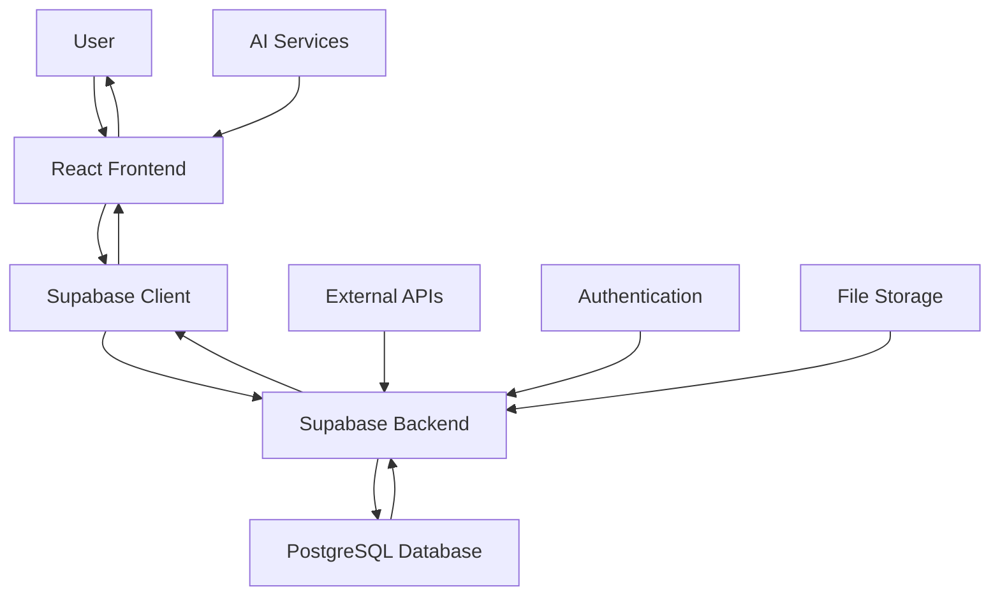

## 2. User Authentication Flow

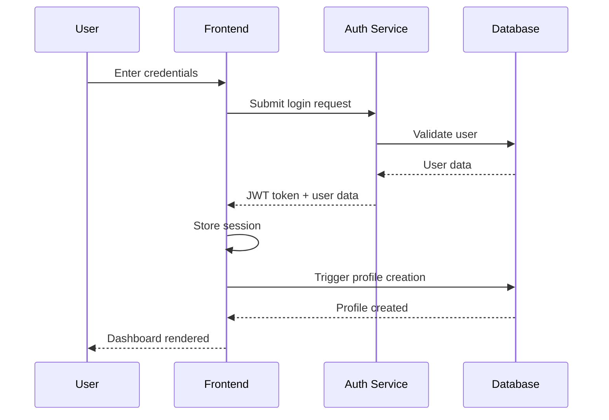

## 3. Transaction Management Flow

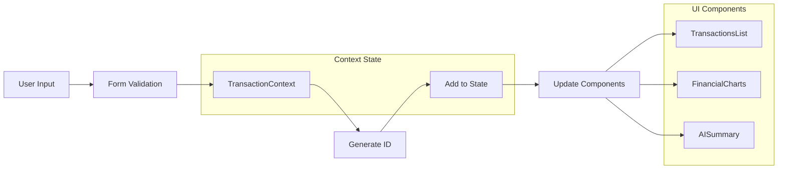

## 4. AI Features Data Flow

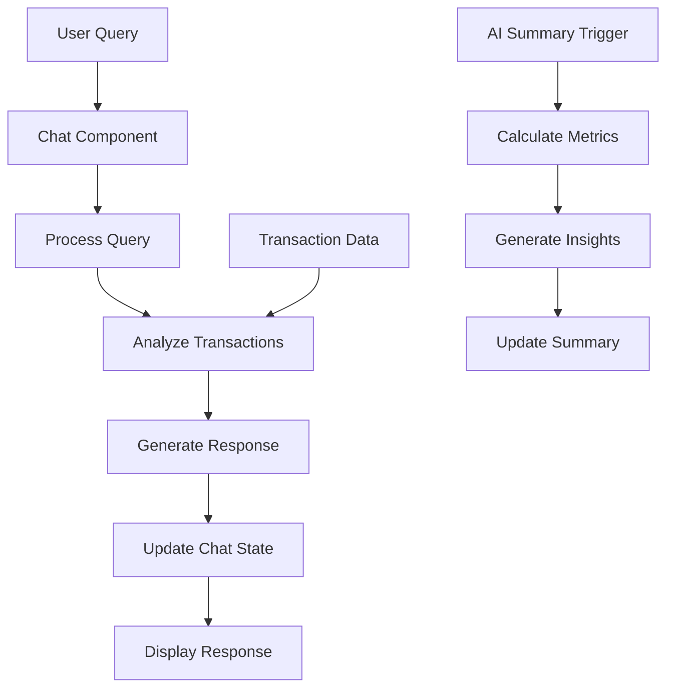

## 5. Component Communication Flow

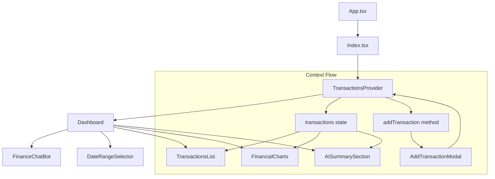

## 6. Database Transaction Flow

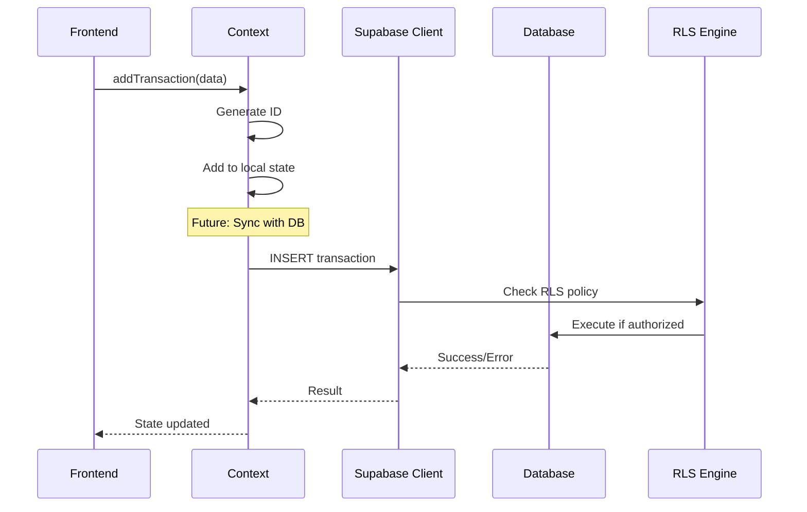

## 7. Real-time Data Synchronization

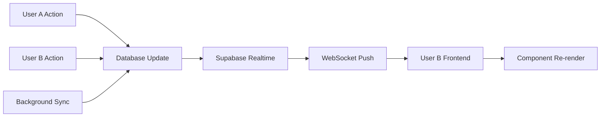

## 8. Error Handling Flow

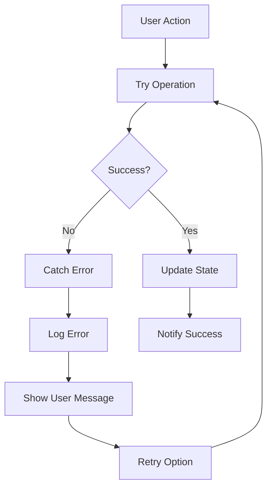

## 9. Mobile vs Desktop Flow

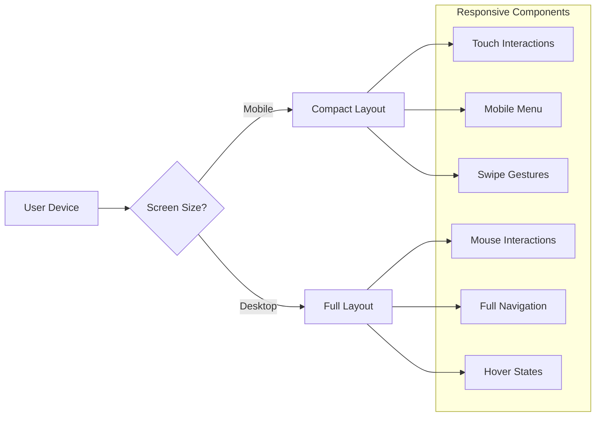

## 10. State Management Flow

```mermaid
graph TB
    A[Initial State] --> B[User Action]
    B --> C[Dispatch Action]
    C --> D[Context Update]
    D --> E[Component Re-render]
    E --> F[UI Update]
    
    subgraph "React Context"
        G[TransactionsContext]
        H[transactions: Transaction[]]
        I[addTransaction: Function]
        G --> H
        G --> I
    end
    
    C --> G
```

## 11. Security Data Flow

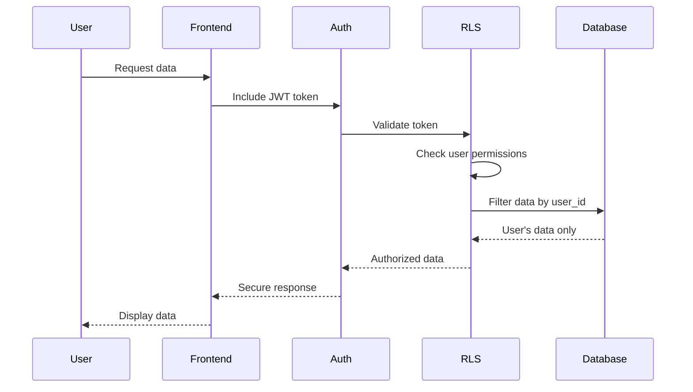

## 12. Performance Optimization Flow

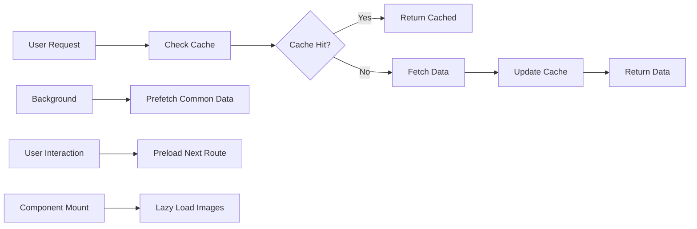

## Data Flow Summary

### Key Patterns:
1. **Unidirectional Data Flow**: Data flows down through components via props and context
2. **Event-Driven Updates**: User actions trigger state changes that propagate through the system
3. **Security-First**: All data access goes through authentication and authorization layers
4. **Optimistic Updates**: UI updates immediately while syncing with backend
5. **Error Boundaries**: Graceful error handling at multiple levels
6. **Performance Optimized**: Caching, lazy loading, and efficient re-rendering

### Critical Paths:
1. **Authentication**: Login → Token → Session → Protected Routes
2. **Transaction Creation**: Form → Validation → Context → UI Update
3. **Data Synchronization**: Local State ↔ Database ↔ Real-time Updates
4. **AI Processing**: User Query → Analysis → Response Generation → Display

This data flow design ensures efficient, secure, and user-friendly operation of the expense tracker application.
