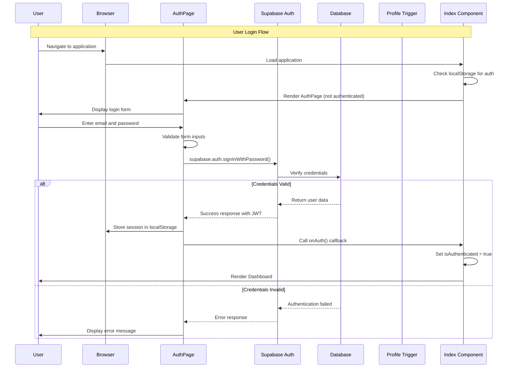
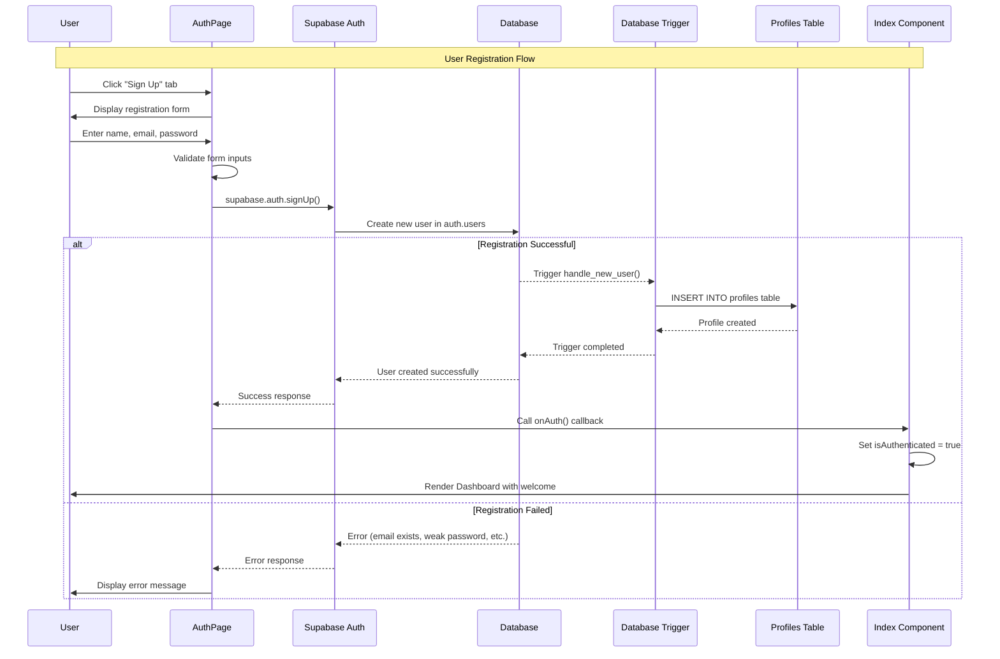
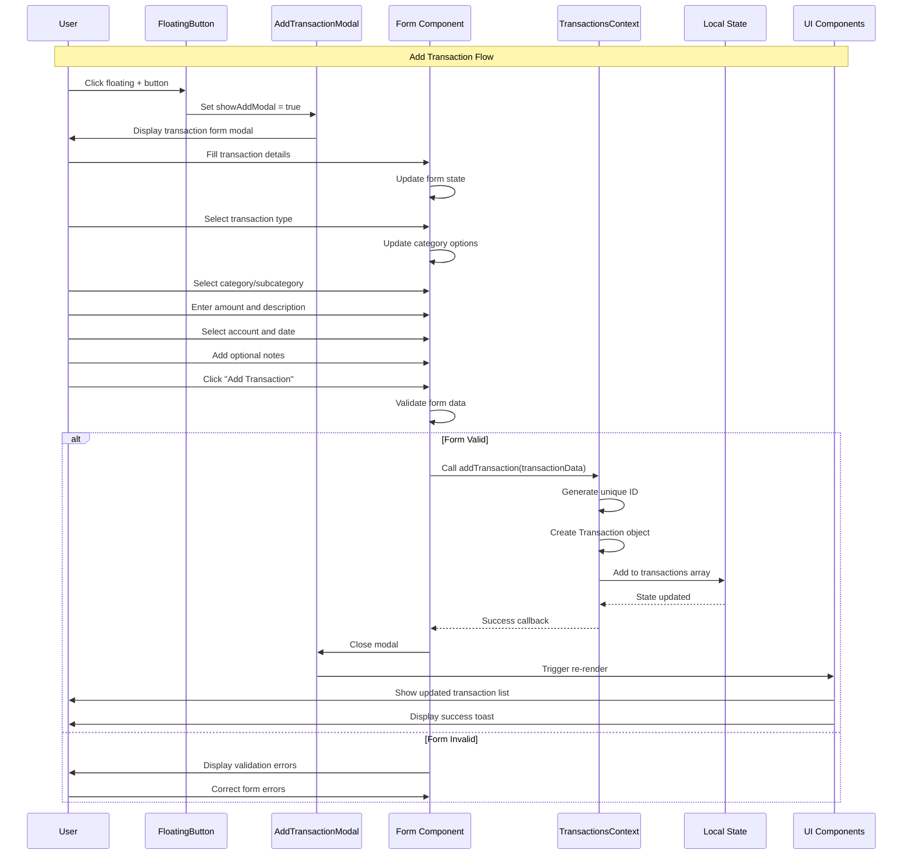
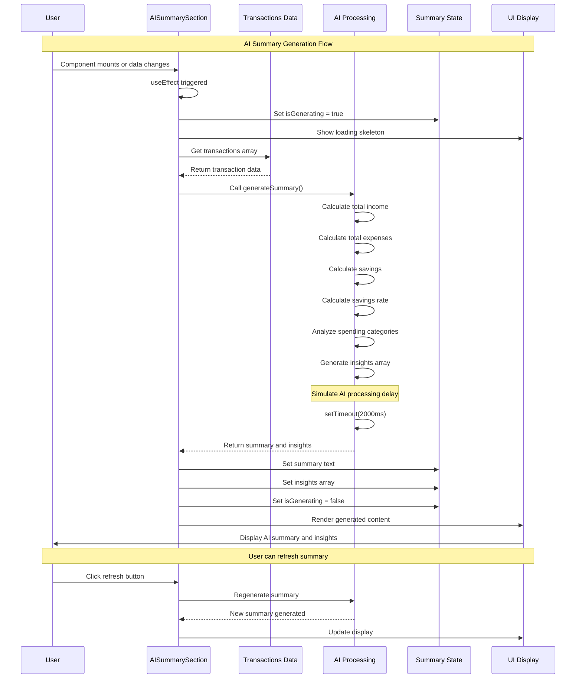
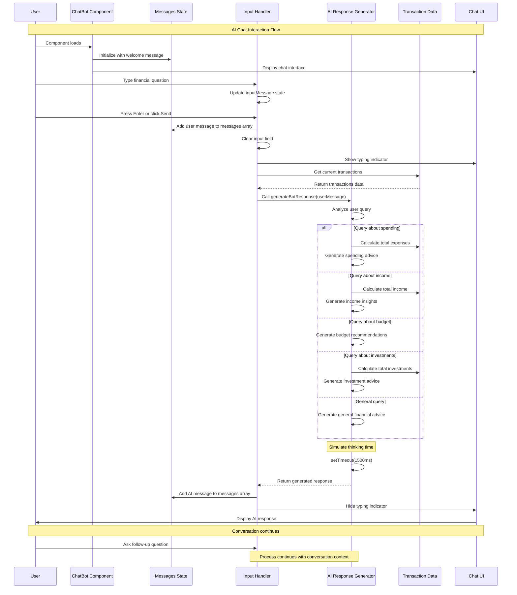
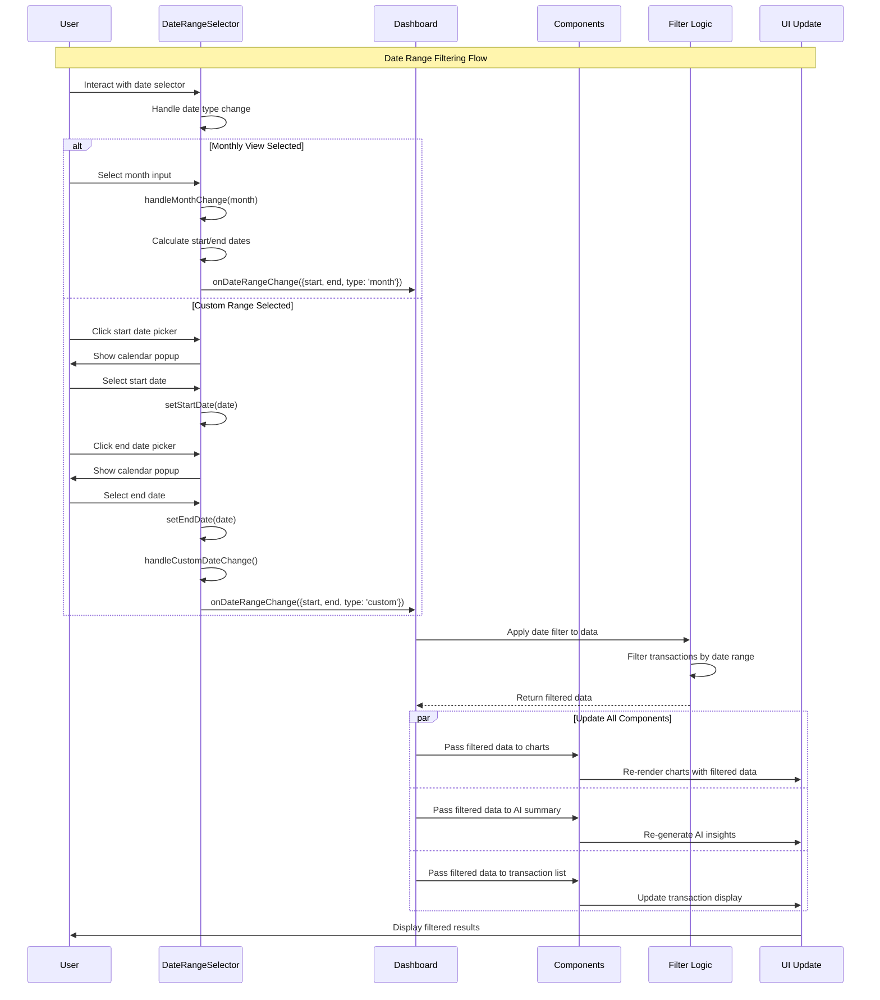
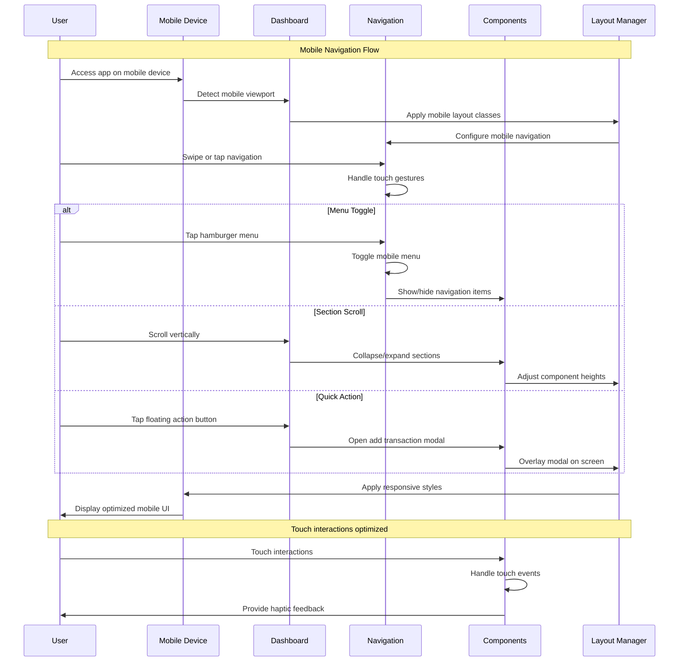
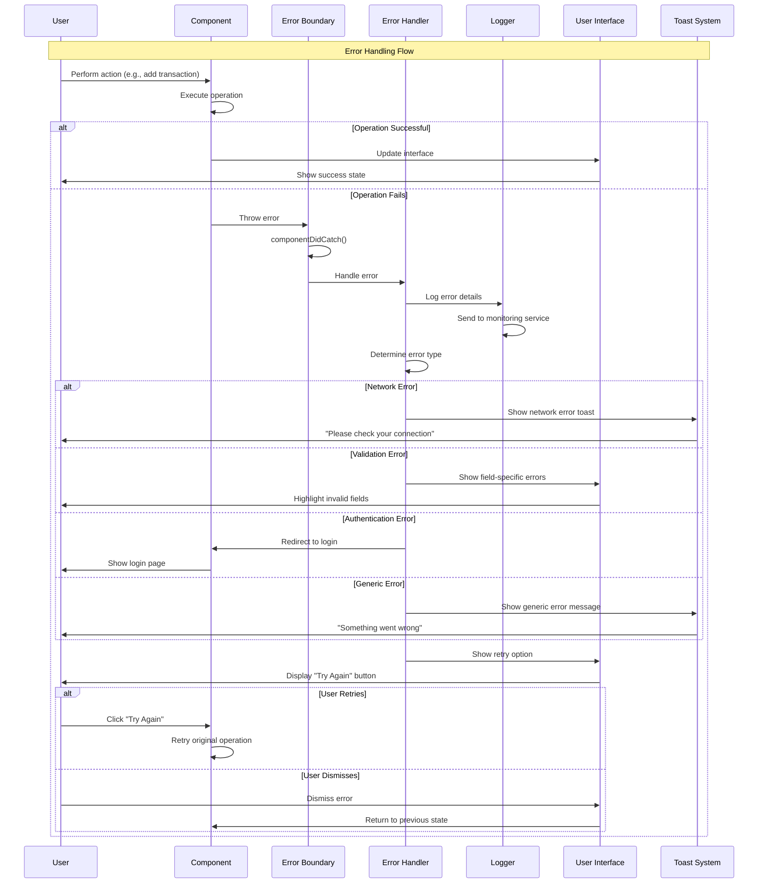
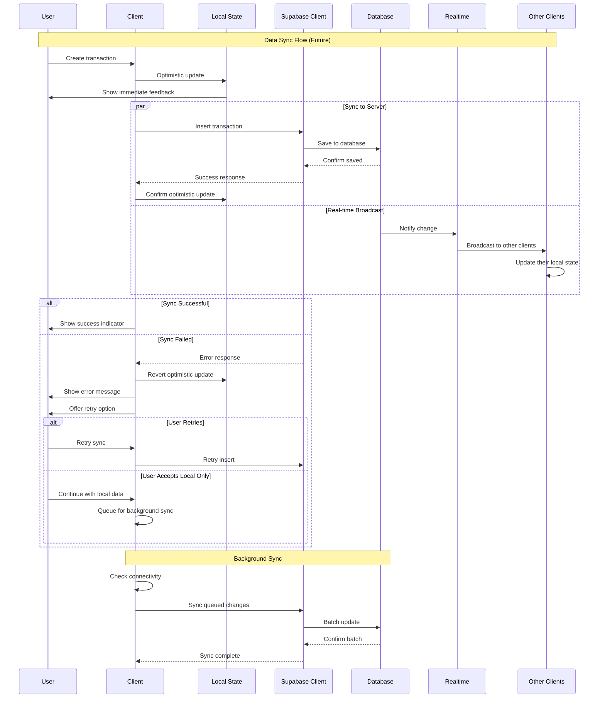
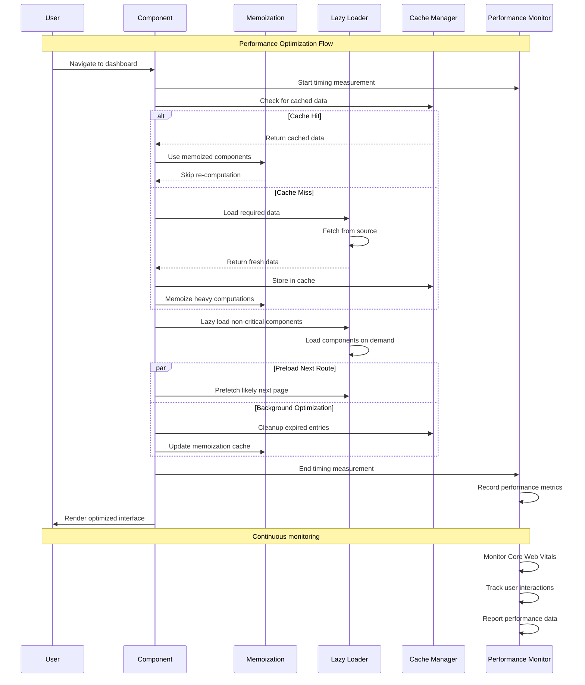

# Sequence Diagrams

## 1. User Authentication Sequence



## 2. User Registration Sequence



## 3. Transaction Creation Sequence



## 4. Dashboard Data Loading Sequence

```mermaid
sequ encediagram
    participant U as User
    participant D as Dashboard
    participant C as TransactionsContext
    participant TL as TransactionsList
    participant FC as FinancialCharts
    participant AS as AISummarySection
    participant CB as ChatBot
    participant M as Mock Data
    
    Note over U,M: Dashboard Loading Flow
    U->>D: Navigate to dashboard
    D->>C: useTransactions() hook
    C->>M: Load mockTransactions
    M-->>C: Return transaction array
    C-->>D: Provide transactions context
    
    par Parallel Component Loading
        D->>TL: Pass transactions prop
        TL->>TL: Sort and format transactions
        TL->>U: Render transaction list
    and
        D->>FC: Pass transactions prop
        FC->>FC: Process data for charts
        FC->>FC: Generate chart data
        FC->>U: Render financial charts
    and
        D->>AS: Pass transactions prop
        AS->>AS: Calculate financial metrics
        AS->>AS: Generate AI insights
        AS->>U: Render summary section
    and
        D->>CB: Pass transactions prop
        CB->>CB: Initialize chat state
        CB->>U: Render chat interface
    end
    
    Note over D,U: All components loaded
    D->>U: Dashboard fully rendered
```

## 5. AI Summary Generation Sequence



## 6. AI Chat Interaction Sequence



## 7. Date Range Filtering Sequence



## 8. Mobile Navigation Sequence



## 9. Error Handling Sequence



## 10. Data Synchronization Sequence (Future Implementation)



## 11. Performance Optimization Sequence



These sequence diagrams provide detailed insights into the temporal behavior and interactions between different components of the expense tracker application, covering both current functionality and future enhancements.
