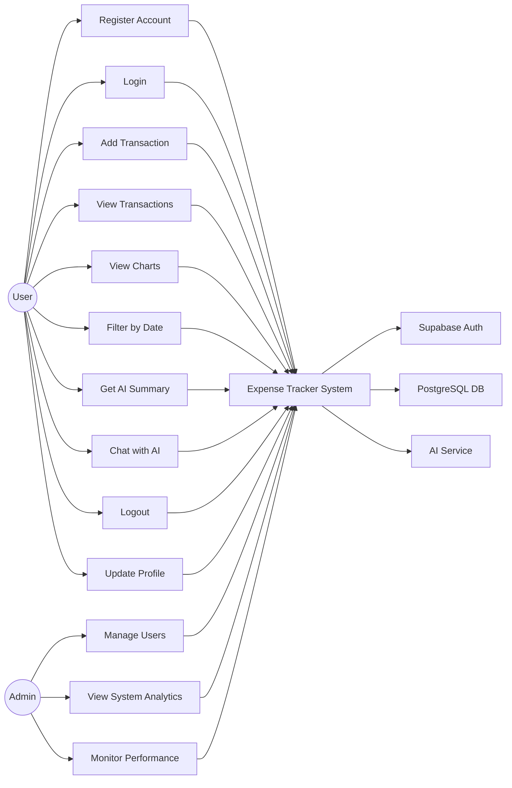
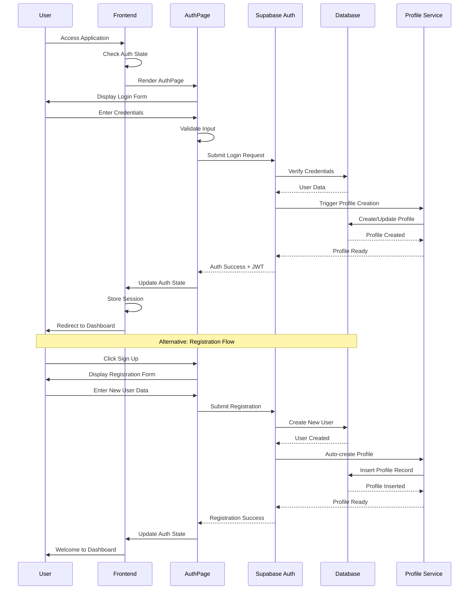
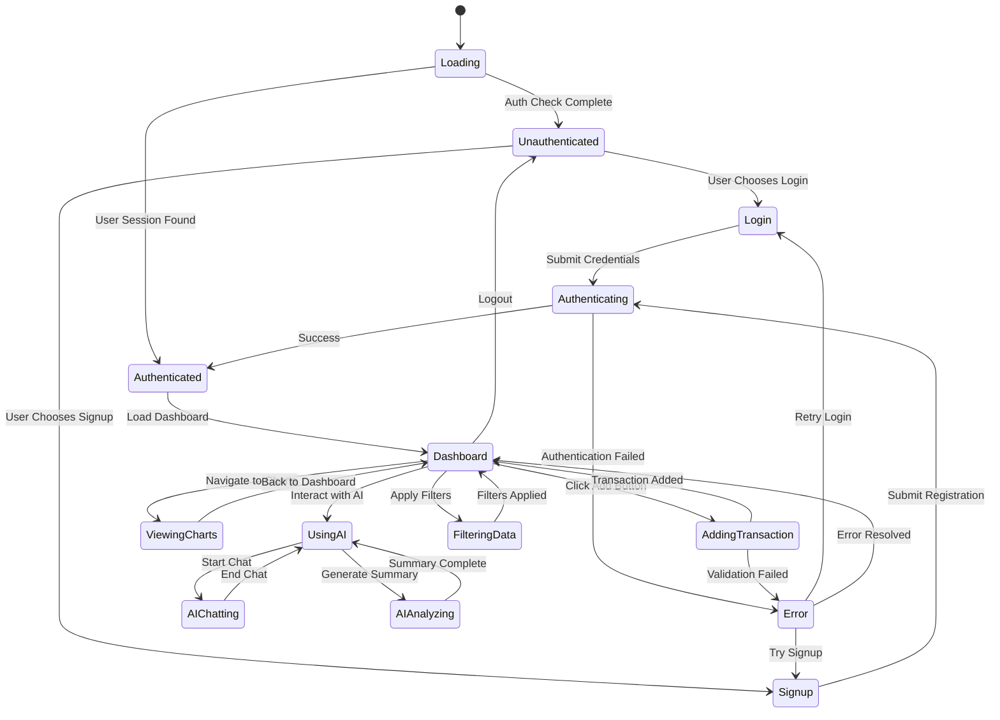
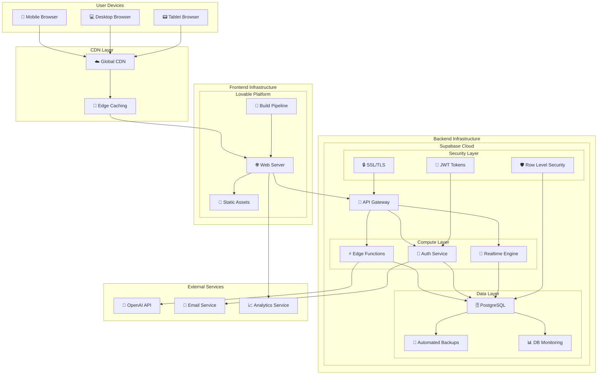
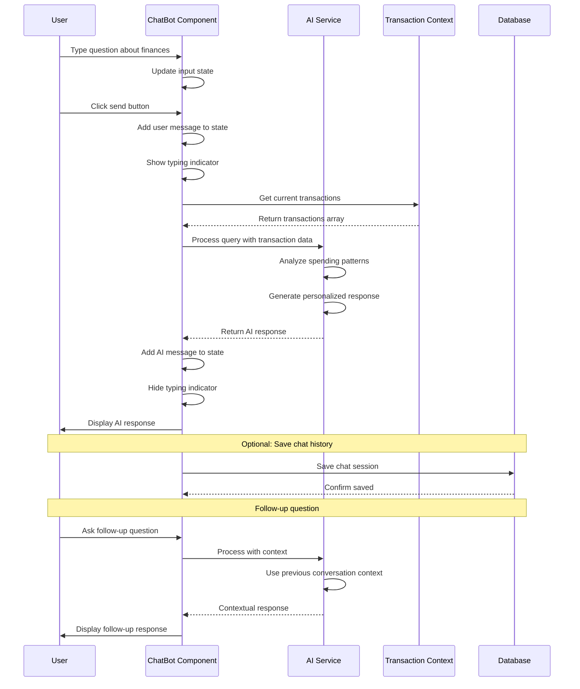
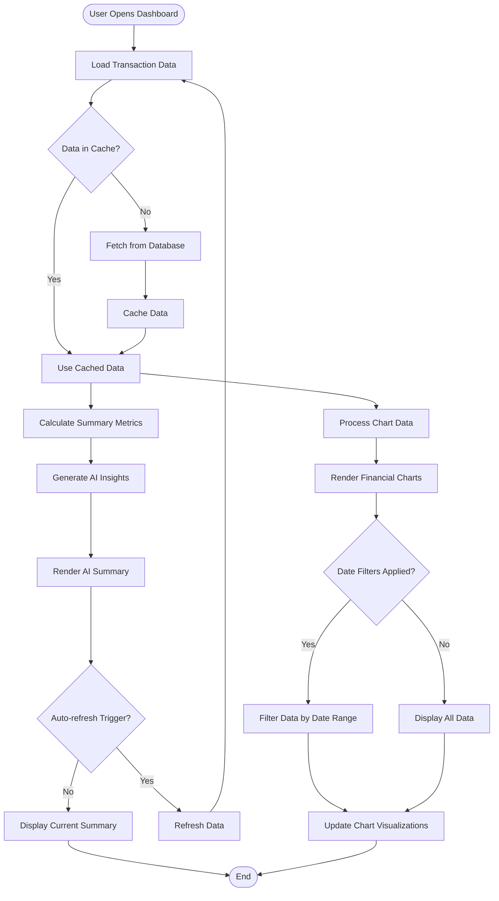
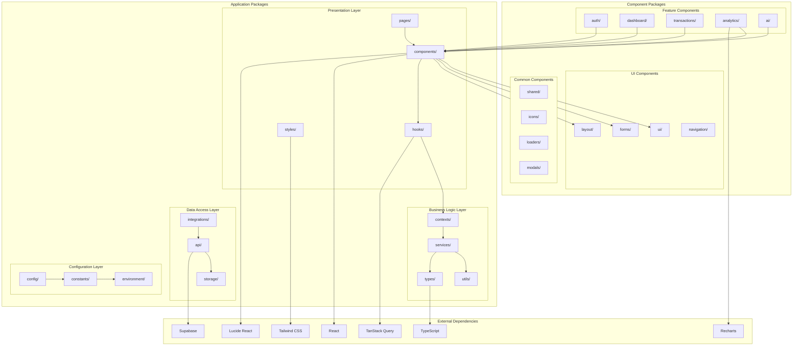

# UML Diagrams

## 1. Use Case Diagram



## 2. Activity Diagram - Transaction Creation

```mermaid
graph TD
    Start([User clicks Add Transaction]) --> OpenModal[Open Transaction Modal]
    OpenModal --> SelectType[Select Transaction Type]
    SelectType --> EnterAmount[Enter Amount]
    EnterAmount --> EnterDesc[Enter Description]
    EnterDesc --> SelectCategory[Select Category]
    SelectCategory --> SelectSubcat[Select Subcategory]
    SelectSubcat --> SelectAccount[Select Account]
    SelectAccount --> SelectDate[Select Date]
    SelectDate --> EnterNotes[Enter Notes (Optional)]
    EnterNotes --> ValidateForm{Form Valid?}
    ValidateForm -->|No| ShowError[Show Validation Error]
    ShowError --> SelectType
    ValidateForm -->|Yes| SubmitForm[Submit Form]
    SubmitForm --> GenerateID[Generate Transaction ID]
    GenerateID --> AddToContext[Add to Transactions Context]
    AddToContext --> UpdateUI[Update UI Components]
    UpdateUI --> CloseModal[Close Modal]
    CloseModal --> ShowSuccess[Show Success Message]
    ShowSuccess --> End([End])
```

## 3. Sequence Diagram - User Authentication



## 4. State Diagram - Application States



## 5. Component Diagram

```mermaid
graph TB
    subgraph "Frontend Layer"
        subgraph "React Application"
            App[App Component]
            Index[Index Component]
            Auth[AuthPage Component]
            Dashboard[Dashboard Component]
            
            subgraph "Feature Components"
                TransList[TransactionsList]
                Charts[FinancialCharts]
                AISum[AISummarySection]
                AIChat[FinanceChatBot]
                DateSel[DateRangeSelector]
                AddModal[AddTransactionModal]
            end
            
            subgraph "Context Layer"
                TransCtx[TransactionsContext]
                AuthCtx[Auth Context]
            end
            
            subgraph "UI Components"
                Button[Button]
                Card[Card]
                Input[Input]
                Modal[Modal]
                Select[Select]
            end
        end
        
        subgraph "Utilities"
            Utils[Date/Currency Utils]
            Validation[Form Validation]
            Charts_Utils[Chart Processing]
        end
    end
    
    subgraph "API Layer"
        SupaClient[Supabase Client]
        QueryClient[TanStack Query]
    end
    
    subgraph "Backend Layer"
        subgraph "Supabase Services"
            AuthService[Auth Service]
            DBService[Database Service]
            EdgeFuncs[Edge Functions]
            RealtimeService[Realtime Service]
        end
        
        subgraph "Database"
            PostgreSQL[(PostgreSQL)]
            RLS[Row Level Security]
            Triggers[Database Triggers]
        end
    end
    
    App --> Index
    Index --> Auth
    Index --> Dashboard
    Index --> TransCtx
    
    Dashboard --> TransList
    Dashboard --> Charts
    Dashboard --> AISum
    Dashboard --> AIChat
    Dashboard --> DateSel
    
    Index --> AddModal
    
    TransCtx --> TransList
    TransCtx --> Charts
    TransCtx --> AISum
    
    TransList --> Card
    Charts --> Utils
    AISum --> Charts_Utils
    AddModal --> Button
    AddModal --> Input
    AddModal --> Select
    AddModal --> Validation
    
    App --> SupaClient
    SupaClient --> AuthService
    SupaClient --> DBService
    SupaClient --> RealtimeService
    
    AuthService --> PostgreSQL
    DBService --> PostgreSQL
    DBService --> RLS
    EdgeFuncs --> PostgreSQL
    PostgreSQL --> Triggers
```



## 6. Deployment Diagram



## 7. Class Diagram - Core Domain

```mermaid
classDiagram
    class User {
        +string id
        +string email
        +string fullName
        +string avatarUrl
        +Date createdAt
        +Date updatedAt
        +login()
        +logout()
        +updateProfile()
    }
    
    class Transaction {
        +string id
        +string userId
        +TransactionType type
        +number amount
        +string description
        +string category
        +string subcategory
        +string account
        +Date date
        +string note
        +Date createdAt
        +Date updatedAt
        +validate()
        +format()
    }
    
    class Category {
        +string id
        +string name
        +TransactionType type
        +string[] subcategories
        +string userId
        +boolean isDefault
        +addSubcategory()
        +removeSubcategory()
    }
    
    class Account {
        +string id
        +string userId
        +string name
        +AccountType type
        +number balance
        +boolean isActive
        +Date createdAt
        +updateBalance()
        +activate()
        +deactivate()
    }
    
    class AIChat {
        +string id
        +string userId
        +string title
        +Message[] messages
        +Date createdAt
        +Date updatedAt
        +addMessage()
        +generateResponse()
        +clearHistory()
    }
    
    class Message {
        +string id
        +string chatId
        +string content
        +MessageSender sender
        +Date timestamp
        +format()
    }
    
    class FinancialSummary {
        +string userId
        +DateRange period
        +number totalIncome
        +number totalExpenses
        +number totalInvestments
        +number savingsRate
        +Insight[] insights
        +calculate()
        +generateInsights()
    }
    
    class Insight {
        +string id
        +InsightType type
        +string title
        +string description
        +number impact
        +string[] recommendations
        +format()
    }
    
    User ||--o{ Transaction : owns
    User ||--o{ Category : creates
    User ||--o{ Account : manages
    User ||--o{ AIChat : initiates
    Transaction }o--|| Category : belongs_to
    Transaction }o--|| Account : from
    AIChat ||--o{ Message : contains
    User ||--|| FinancialSummary : has
    FinancialSummary ||--o{ Insight : generates
    
    <<enumeration>> TransactionType
    TransactionType : income
    TransactionType : expense
    TransactionType : investment
    
    <<enumeration>> AccountType
    AccountType : checking
    AccountType : savings
    AccountType : credit_card
    AccountType : investment
    AccountType : cash
    
    <<enumeration>> MessageSender
    MessageSender : user
    MessageSender : ai
    
    <<enumeration>> InsightType
    InsightType : positive
    InsightType : negative
    InsightType : neutral
```

## 8. Sequence Diagram - AI Chat Interaction



## 9. Activity Diagram - Data Analysis Flow



## 10. Package Diagram



These UML diagrams provide a comprehensive view of the system architecture, component relationships, user interactions, and data flow patterns within the expense tracker application.
